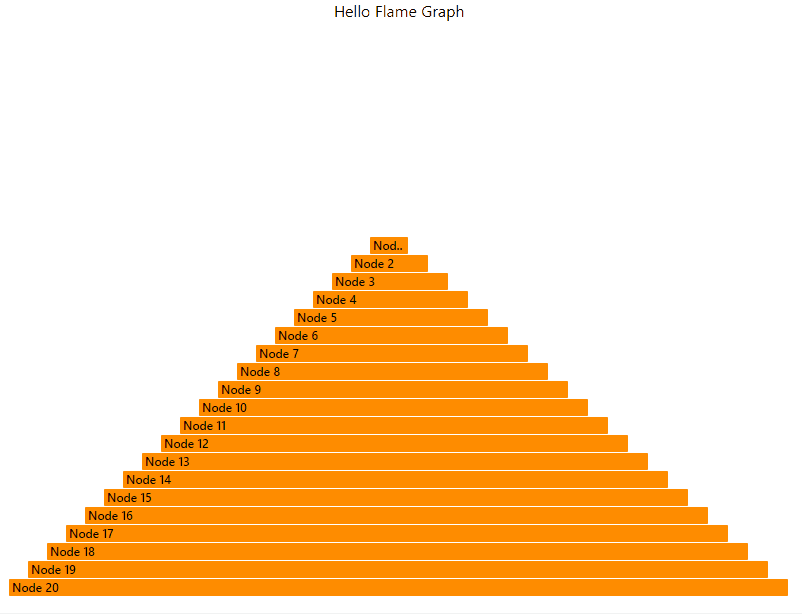

# Flame Graph .NET

## Description

A .NET library that makes creating flame graph, output svg content easily.

## Get started

* Generate a flame graph like this:



* Add reference to the package:

```shell
dotnet add package FlameGraph.Net
```

* Crate a class that implements the IFlameGraphNode interface:

```csharp
class SimpleNode : IFlameGraphNode
{
    public string Content { get; set; }

    public double Metric { get; set; }

    public List<IFlameGraphNode> Children { get; } = new List<IFlameGraphNode>();
}
```

* Create tree structure using the the node class above:

```csharp
private static void SimpleNodeExample()
{
    // Get the tree
    const int nodeCount = 20;
    SimpleNode root = new SimpleNode()
    {
        Content = $"Node {nodeCount.ToString("0")}",
        Metric = nodeCount,
    };
    root = AppendChildren(root, nodeCount);

    // Create a graph factory with options.
    FlameGraph newGraph = new FlameGraph(new FlameGraphOptions()
    {
        Title = "Hello Flame Graph",
        Width = 800,
        Height = 600,
    });

    // Output the svg
    string fileName = nameof(SimpleNodeExample) + ".svg";
    DeleteFileWhenExists(fileName);
    newGraph.BuildTo(root, fileName);
}

// Generate a simple tree.
private static SimpleNode AppendChildren(SimpleNode current, double metricValue)
{
    metricValue--;
    if (metricValue > 0)
    {
        SimpleNode newChild = new SimpleNode()
        {
            Content = $"Node {metricValue.ToString("0")}",
            Metric = metricValue,
        };

        current.Children.Add(AppendChildren(newChild, metricValue));
    }
    return current;
}

private static void DeleteFileWhenExists(string resultFilePath)
{
    if (File.Exists(resultFilePath))
    {
        File.Delete(resultFilePath);
    }
}
```

## Advanced Topics

### Manual height vs Auto height by tree depth

By default, there's option to control the generated svg height. For example, the following option is going to make an svg of heights of 1000.
In this mode, the callstack on the graph might be truncated, only limited levels could fit into the height.

```csharp
FlameGraph graph = new FlameGraph(new FlameGraphOptions()
{
    Title = "Hello Flame Graph",
    Width = 800,
    Height = 1000
});
```

Sometimes, it will be convenient to just generate an svg that fits shows all stacks - no matter the height. An option of `AutoHeight` is provided:

```csharp
FlameGraph graph = new FlameGraph(new FlameGraphOptions()
{
    Title = "Hello Flame Graph",
    Width = 800,
    AutoHeight = true, // Set auto height to true
    Height = 1000  // This setting will be overwritten and takes no effect.
});
```

In this case, the graph height will be calculated automatically to fit the whole stack. The deeper the tree passed in, the taller the height becomes.

### Using any existing tree node as flame graph node

The key is to provide 3 delegates to extract the following items from a existing object:

* Content
* Metric
* Children

Here's an example:

```csharp
private static void NodeAdapterExample()
{
    // Create delegates for adaption
    Func<TreeNode, string> getContent = n => n.Text;
    Func<TreeNode, double> getMetric = n => n.Value;
    Func<TreeNode, IEnumerable<TreeNode>> getChildren = n => n.Children;

    // Generate an example tree
    const int levels = 20;
    TreeNode root = new TreeNode("Root", levels);
    root = AppendChildren(root, levels);

    // Adapter the tree
    var wrappedRoot = new FlameGraphNode<TreeNode>(root, getContent, getMetric, getChildren);

    // Output the svg stream to file.
    FlameGraph graph = new FlameGraph(new FlameGraphOptions()
    {
        Title = "Hello Flame Graph",
        Width = 800,
        Height = 600,
    });

    using Stream svgStream = graph.Build(wrappedRoot);
    using FileStream fileStream = new FileStream($"{nameof(NodeAdapterExample)}.svg", FileMode.Create, FileAccess.Write);
    svgStream.CopyTo(fileStream);
}

private static TreeNode AppendChildren(TreeNode current, double metricValue)
{
    metricValue--;
    if (metricValue > 0)
    {
        TreeNode newChild = new TreeNode($"Node {metricValue.ToString("0")}", metricValue);
        current.Children.Add(AppendChildren(newChild, metricValue));
    }
    return current;
}
```

TreeNode is a class that doesn't implement IFlameGraphNode. 3 delegates are crated to extract enough information from it:

```csharp
    // Create delegates for adaption
    Func<TreeNode, string> getContent = n => n.Text;
    Func<TreeNode, double> getMetric = n => n.Value;
    Func<TreeNode, IEnumerable<TreeNode>> getChildren = n => n.Children;
```

And then a wrappedRoot is created based on the info:

```csharp
var wrappedRoot = new FlameGraphNode<TreeNode>(root, getContent, getMetric, getChildren);
```

The rest of it shows to write the stream output to a file directly.
